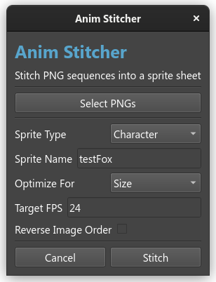

# Using anim_stitcher

`anim_stitcher` is a Python utility designed to allow artists to automatically convert their frames into sprite sheets with metadata.

## Usage

To launch `anim_stitcher`, you must first have all the Python dependencies installed. This means installing Python and pip, then running the following in the root of the project:

```sh
python3 -m pip install -r requirements.txt
```

*For help with this, contact Evan.*

### Launching the tool

If you are on a Linux system, you can launch the tool with `./launch_anim_stitcher.sh`. 

Otherwise, open the project root folder, and run the `launch_anim_stitcher.bat` script. This will show a window similar to the following:



As you can see, I have already filled everything out for the `testFox` asset. 

**When selecting PNGs:** Make sure you shift-click to select multiple files. You don't want a spritesheet with only one frame in it.

## Technical information

`anim_stitcher` exports spritesheets to `game/dist/assets/anm/...`. Each spritesheet also has a metadata JSON file beside it. The filepaths are automatically chosen based on input in the GUI.

An example output would be for an asset named `testFox` with the `Character` type.

```text
...
game/dist/assets/anm/chr/chr_testFox:
     - chr_testFox.png
     - chr_testFox.anim_meta.json
...
```
